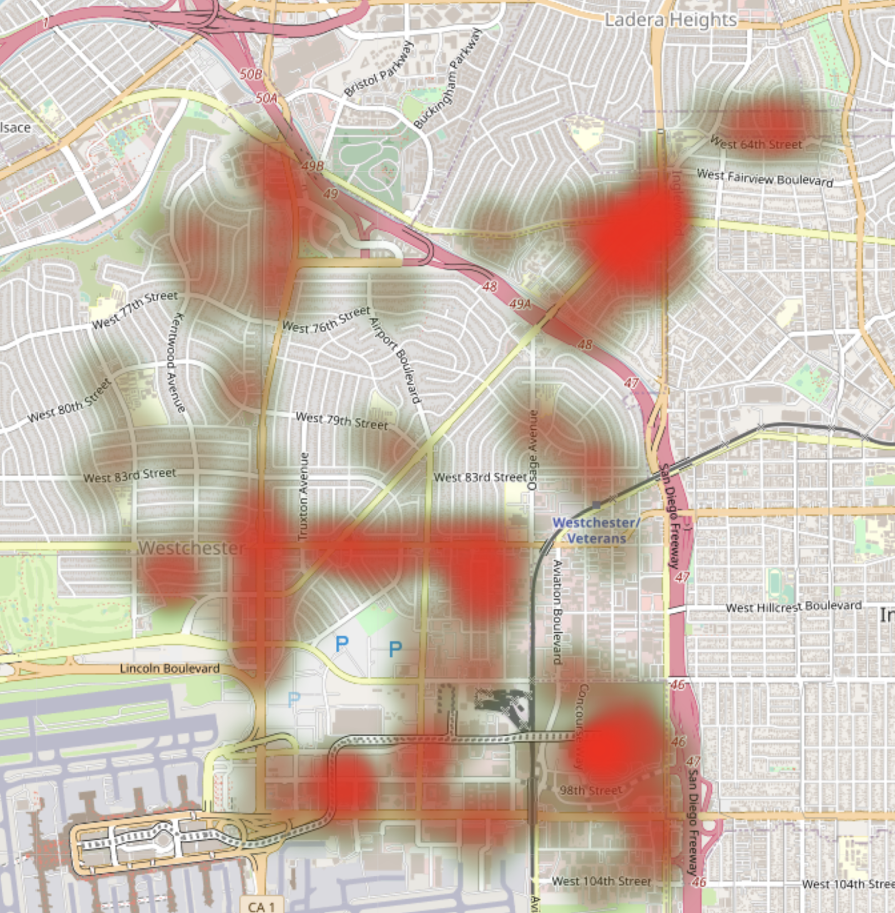
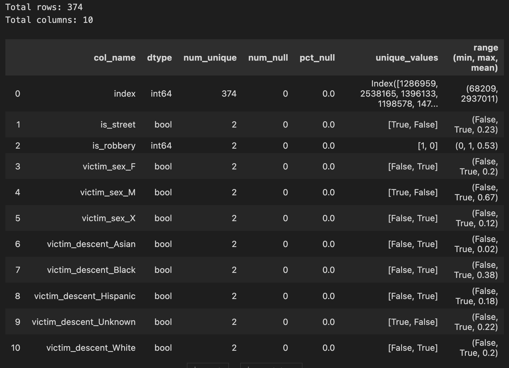

<p style="text-align: center"> 

# Evaluating Inglewood Area Robberies
</p>

---
 
Zacharia Schmitz

3 October 2023

<p style="text-align: center;"> 



*Heatmap of Robberies in Cluster 4 (Inglewood area)*

--- 

### Jump To:

[Project Overview](#overview)

[Data Acquisition](#acquire)

[Preparation](#preparation-steps)

[Exploration](#explore)

[Models](#modeling)

[Conclusion](#conclusions)

</p>

---

<br>
<br>
<font size='5'> From the City of Los Angeles website about the data:</font>

- This dataset reflects incidents of crime in the City of Los Angeles from 2010 - 2019. 

- This data is transcribed from original crime reports that are typed on paper and therefore there may be some inaccuracies within the data. 

- Some location fields with missing data are noted as (0°, 0°). Address fields are only provided to the nearest hundred block in order to maintain privacy. 

- This data is as accurate as the data in the LA database.
<br>
<br>

---

<br>

## Overview

### Project Goals

- **<u>Initially:</u>** Explore high areas of gun violence in the Los Angeles area and what to do to protect yourself

- **<u>Upon further evaluation</u>**: After it was identified in clustering, explore drivers of the high (almost double) robbery rate in the Inglewood area. Identify features and develop a model to encourage public safety and prevent crime.
<br>
<br>

---

<br>

### Project Description

- I initially started with 2 datasets from the city of Los Angeles.

- After combing, there was close to 3 million rows (2,943,476).

- Each row was a unique incidence of crime in the Los Angeles area.

- There was 29 different features about each crime. This only included the initial report, and not the final closed case details.

- The target variable was a column created from the crime description, 'is_robbery'.

- The comparison was ultimately Cluster 4 (Inglewood Area) versus all of the other areas.
<br>
<br>

---

<br>

### Initial hypotheses

- Time of day is probably a large driver of robberies. Most likely more at night.

- There are probably not very many robberies during the day.

- Gender and age is most likely a driver of robberies. Most likely people preying on females and the very young and old.

- Most robberies are most likely occuring at gunpoint, or assumed to be gunpoint.

<br>
<br>

---

<br>

## Acquire

- **2010 to 2019 Data** *(crime_data_2010_2019).csv*

https://data.lacity.org/Public-Safety/Crime-Data-from-2010-to-2019/63jg-8b9z

- **2020 to 25 Sep 23** *(crime_data_2020_2023).csv*

https://data.lacity.org/Public-Safety/Crime-Data-from-2020-to-Present/2nrs-mtv8

<u><i>Both dataframes shared the same features, and were merged together.</u> </i>

- **Merged CSV Format** *(crime_data.csv)*

https://drive.google.com/file/d/14FBSb-iADac0jENqeEfceTcmRi2Btaoh/view?usp=sharing

<br>
<br>

---

<br>

## Preparation Steps

#### Logically Rename Columns

- Rename columns to make sense for exploration.

#### Choose columns to work with

- Based on what we're looking for, we'll start with only looking at some of the features.

#### Fix Time Occurred

- Change time occurred to 4 digit 24 hour time. We won't move it to index for now, because we may not be doing any time series

#### Fix Victim Age 

- Looks like we have negative values in the victim_age. We will have to drop those, since no fair assumptions can be made.

#### Fix Victim Descent

- We'll map the victim_descent based on abbreviations and assign nulls 'unknown' for exploration before potentially dropping nulls.

#### Fix Victim Sex

- We'll have to map victim_sex. We can assume F = Female, M = Male, X = Non binary. Due to large amount of other values, we will make them 'unknown' rather than imputing any assumptions.

#### Nulls in premise_description 

- Very small amount of nulls in premise_description (0.00023). We'll assign them 'unknown'.

#### Weapon_description 

- 66% Nulls in weapon_description, we'll fill them with 'No Weapon'.

#### Weapon_category

- Make a weapon bin out of all of the weapon_descriptions. No Weapon, Firearm, Melee Object, Threats, Vehicle, Other

#### Create report_delay column

- Take the date of reporting, subtract the crime_occurred.

#### Fix Part 1 & 2

- Part 1 is for heinous crimes & 2 is for less heinous.

#### Fix latitude and longitude

- A total of 3321 values of 0 in both lat/long. We'll sort by the area name, and forward fill so they stay in the correct area.

#### Filter down DF to guns only

- Due to scope of data and time for project, we will only focus on firearm related crimes.

#### Bin Robbery and Attempted Robbery

- We made a column named is_robbery and if the crime was robbery or attempted robbery, we marked it true.

#### Bin Time of Day

- We binned the time of crime to time of day to morning, afternoon, evening, and night.

#### Make a column for crimes that happened on the street.

- It was identified that crimes that a majority of robberies happened on the street. We'll make a binary column for it name is_street.
<br>
<br>

---

<br>

## Explore

- Does age affect the rate of robbery in cluster 4?

- Does time of day affect robbery rate in cluster 4?

- Does the victim's gender affect robbery rate in cluster 4?

- Where are you most likely to be robbed in cluster 4?

- Is the weapon used in cluster 4 different than the rest of Los Angeles?

<br>
<br>

---

<br>

## Modeling

- Use drivers in explore to build predictive models of different types

- Evaluate models on train and validate data

- Select the best model based on accuracy

- Evaluate the test data

*Best Model on Test*

Logistic Regression

```python
C=10
max_iter=1000
penalty="l1"
solver="saga"
random_state=321
```

**Baseline:** 53%

**Test Set:** 60%

<br>
<br>

---

<br>

### Pre-Modeling Data Dictionary:

<p style="text-align: center;"> 




 </p>

<br>
<br>

---

<br>

## How to Reproduce:

1. Clone this repo.

2. Acquire data by:

    - Source the two LA Crime Data files through the links

    <b><u>OR</b></u>

    - Download my combined CSV (750MB) of crime data from LA

    <br>

3. Save CSVs in same folder as Jupyter Notebook with the correct naming convention

4. Run the notebook

    - Do the required pip installs as they come up


<br>
<br>

---

<br>

## Conclusions

### Key Findings / Questions Answered:

**1. Does age affect the rate of robbery in cluster 4?**
- Age does affect the rate of robbert in cluster 4. <br> <br>

**2. Does time of day affect robbery rate in cluster 4?**
- People are much more likely to be robbed in the evening. <br> <br>

**3. Does the victim's gender affect robbery rate in cluster 4?**
- Gender did not strongly affect the robbery rate. <br> <br>

**4. Where are you most likely to be robbed in cluster 4?**
- Most outside areas are very likely to be robbed. Number one being on the street/sidewalk. <br> <br>

**5. Is the weapon used in cluster 4 different than the rest of Los Angeles?**
- We found the weapon used, is not different in cluster 4, compared to the rest of LA.

<br>
<br>

---

<br>

### Takeaways:

- With only 3 identified features, I developed a model with 60% accuracy that outperformed the baseline accuracy of 53%.

    - is_street

    - victim_sex

    - victim_descent

- The best model between SVC, KNN, LR and DTC was LogisticRegression witha train set accuracy of 58%, validation set accuracy of 62%, and a test set accuracy of 60%.

```python
C=10, max_iter=1000, penalty="l1", solver="saga", random_state=321
```

**<i>Given that this model performed 5% better than baseline on our test set, we would expect it to also perform well on unseen data**</i>

<br>
<br>

---

<br>

### **Recommendations**

#### For Modeling: 

- Continue to run feature engineering and potentially test other models with other hyperparameters

- Possibly create models for the other identified clusters

- Potentially include some form of time series analysis to obtain trends

#### For Population:

- Stay out of Inglewood at night

### **Next Steps**

- When dealing with crime rates and stereotypes, model performance is extremely important. Making policing assumptions from a model 7 points better than baseline would not be appropriate.

- Given more time and access suspect information could drastically improve the model.

- Also with more access, the closed case details could cut down on incorrect, and most importantly biased initial reporting.

- Combine with weather data for more insights

- Combine with poverty data for more insights

- Combine with house values for more insights


[Back To Top](#evaluating-inglewood-area-robberies)
